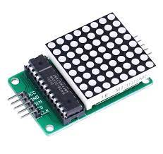
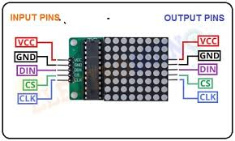
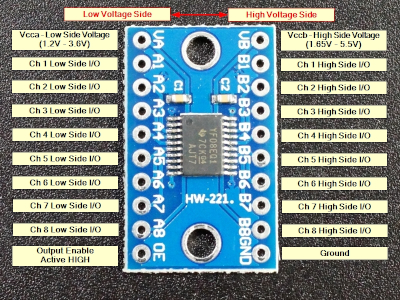

# Pi pico - 8x8 Led Matrix lib
### C library to control 8x8 Led matrix displays based on MAX7219.
 

 

This is a port to Raspberry Pi Pico of library originally developed for Arduino by Larry Bank.

The original Arduino version con be found in github [Larry Banks bitbank2](https://github.com/bitbank2/MAX7219)

The Pi Pico library is implemented as an Interface Library that can be used by applications or other libraries. As with the libraries that come from the SDK, it can be included as a Subdirectory of the main project:
 

`add_subdirectory( PATH_TO_Libled8x8_top_directory )`
 

This library provides low and high level control of 8x8 led displays.
Low level functions provide sending basic commands to the controllers.
- Controllers init
- Test mode: enter / exit
- BCD mode setup
- Set intensity of leds
- Set the limit of rows to control by controller

High level functions allow to:
- Send bitmaps
- Draw images based on strings and defined font.
- Scroll the displayed images

Low level will allow direct control of a line of LEDs in one display.
High level will allow shadow display, scroll, etc.

The controllers communicate via a SPI (Serial Peripheral Interface) interface.
Controllers can be cascaded by connecting the DOUT of one controller to the DIN of the next controller.
 

 

The 8x8 led controller can be cascaded to conform large displays.

An excellent description of the MAX7219 controllers, the commands, programming and cascading can be found in the great article written by Kevin Boone.

 

[Controlling a chain of MAX7219 LED matrices using C on a Raspberry Pi Pico](https://kevinboone.me/pico7219.html?i=1)

 

I really recommend reading Kevin Boones' article to understand how the controllers work.

## A note on the Interface Line Voltage levels

The 8x8 matrix led modules controlled by MAX7219 family are normally designed to operate with 5 volts power supply.
Pi Pico GPIOs operates only at maximum of 3.3 volts level for both Input and Output.

The MAX7219 only provides input lines. DIN, CLK and /OE. So, there is no risk for the Pi Pico in a direct connection to the 8x8 led module.

But the GPIO output levs are not really compatible with the MAX7219 ones.

From the datasheets we have:

MAX7219 family
Logic High Input Voltage 
VIH min 3.5v

RP2040 (pi pico )
Output Voltage High @IOVDD=3.3V
VOH 2.62

For secure and stable designs some kind of level conversion is needed.
The chip TXS0108E is a good option. It can be obtained in the for of a module to integrate with other module boards.

